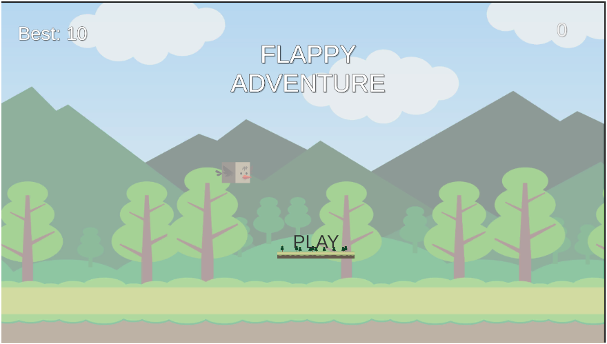
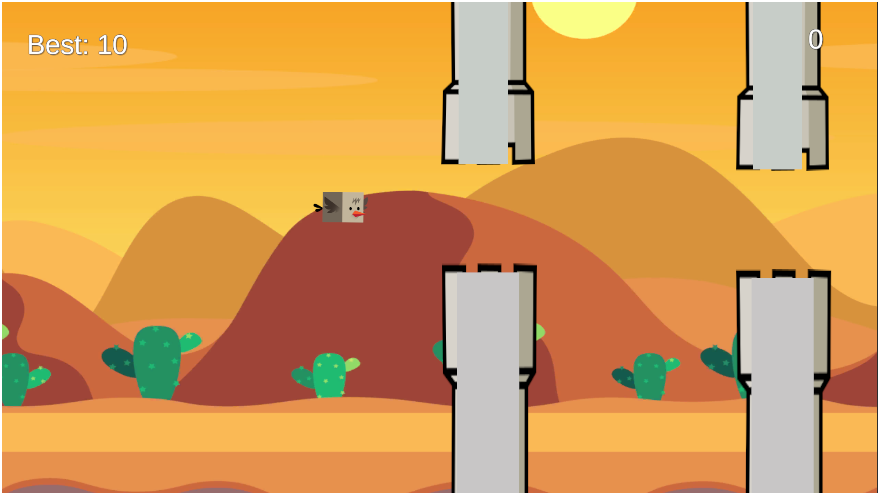
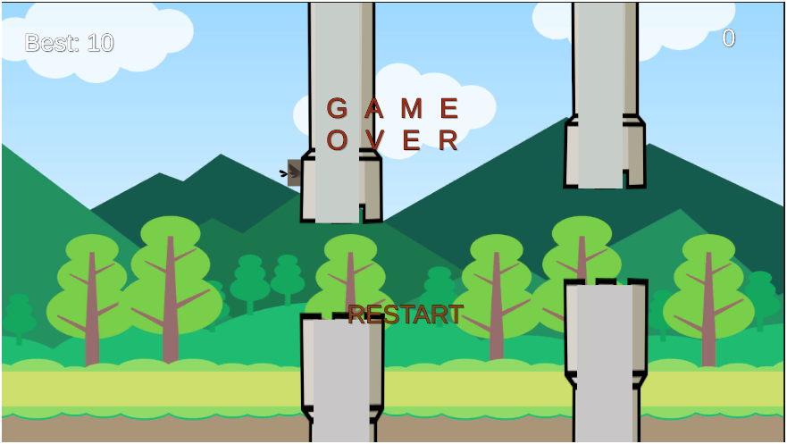

# 🐦 Flappy Adventure

A 2D arcade game developed with **Unity 6.3 LTS** and **C#**.

Flappy Adventure is a fast-paced obstacle-avoidance game where the player controls a bird, flies through pipes, avoids collisions, and tries to achieve the highest possible score.

## 🎮 Gameplay

The game starts with a simple menu and becomes progressively challenging as the player continues flying.

### Features

- 🐦 Physics-based bird movement
- 🟢 Pipe spawning and movement system
- 💥 Collision detection and Game Over system
- 🏆 Score and persistent High Score
- 📈 Progressive difficulty
- 🌄 Multiple environments
- 🎵 Background music
- 🔊 Gameplay sound effects
- 🔄 Restart system
- ⌨️ Keyboard controls
- 📱 Android touch controls
- 🖥️ Landscape orientation support

## 🎮 Controls

### PC

`Space` → Flap

### Android

`Tap the screen` → Flap

## 🛠️ Built With

- Unity 6.3 LTS
- C#
- Unity 2D Physics
- Unity Input System
- TextMeshPro
- Unity Audio System

## 📱 Platform

- Android
- Windows / PC development build

## 📸 Screenshots

### Start Screen



### Gameplay



### Game Over



## 📥 Download

### Android APK

Download the latest Android build from the GitHub Releases page:

👉 **[Download Flappy Adventure](https://github.com/thundereye13/Flappy-Adventure/releases/latest)**

### itch.io

Play/download the game from itch.io:

👉 **[Flappy Adventure on itch.io](https://thundereye13.itch.io/flappy-adventure)**

## 📂 Project Structure

```text
Flappy-Adventure/
│
├── Assets/
│   ├── Scenes/
│   ├── Scripts/
│   ├── Prefabs/
│   ├── Audio/
│   ├── Sprites/
│   └── ...
│
├── Packages/
├── ProjectSettings/
├── Screenshots/
│   ├── start-screen.png
│   ├── gameplay.png
│   └── game-over.png
│
├── README.md
├── .gitignore
└── LICENSE
